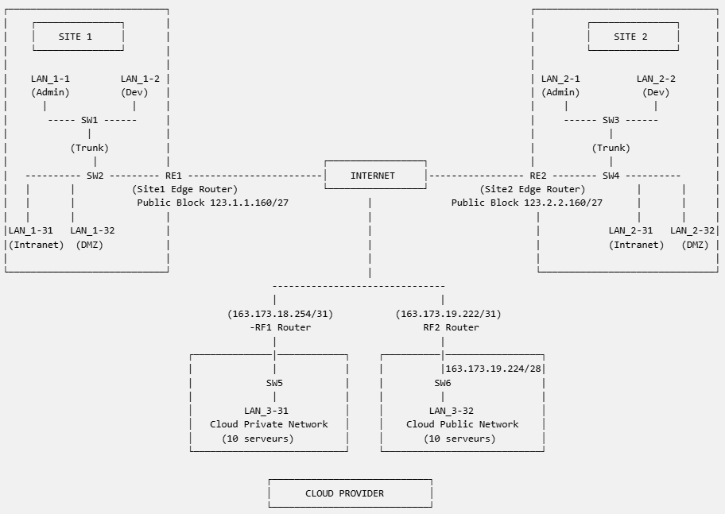

# Architecture Réseau Multi-Sites Sécurisée avec Extension Cloud
## VLAN – ACL – DHCP – NAT – Segmentation Applicative
### Schéma de l'architecture globale  
  
---
### Objectif du Projet

Concevoir et simuler une architecture réseau d’entreprise multi-sites sécurisée intégrant segmentation, filtrage avancé et extension vers un environnement Cloud hybride.

Les plages d’adressage utilisées correspondent au schéma fourni dans le cadre du projet et sont exploitées uniquement dans un environnement de simulation.  

### Présentation

Le projet présente la conception et l’implémentation d’une architecture réseau (à l’aide de GNS3) d’entreprise multi-sites intégrant :

- Segmentation logique via VLAN
- Plan d’adressage optimisé (VLSM)
- Routage inter-VLAN (Router-on-a-Stick)
- Isolation des flux par ACL
- Attribution dynamique d’adresses IP (DHCP) pour les postes utilisateurs
- Traduction d’adresses (NAT) pour l’accès Internet
- Découpage et optimisation d’un bloc IPv4 public
- Un déploiement hybride avec extension vers un fournisseur de Cloud
- Une simulation complète sous GNS3  

L’objectif est de mettre en œuvre une architecture sécurisée, évolutive et conforme aux bonnes pratiques réseau en environnement professionnel.
---
###  Architecture Globale

L’entreprise dispose de deux sites géographiquement distincts :

- **Site 1** le siège social
- **Site 2** une agence régionale  
- **Cloud** pour étendre son infrastructure

Chaque site comprend :  
- 1 routeur d’accès Internet (RE1 / RE2)  
- 2 switches interconnectés en trunk 802.1Q  
- 4 sous-réseaux :  
    - VLAN Administratif  
    - VLAN Développeurs  
    - VLAN Serveurs Intranet  
    - VLAN Serveurs Publics (DMZ)  
- Liaison WAN vers opérateur  

Le Cloud comprend :  

- LAN_3-31 (Intranet Cloud)  
- LAN_3-32 (Public Cloud)  

Les serveurs publics sont publiés en IPv4 publique via NAT statique.
Les réseaux internes utilisent des plages privées avec NAT dynamique.

---

### Plan d’adressage

#### Site 1  
Plage publique : 123.1.1.160/27

#### Site 2
Plage publique : 123.2.2.160/27

#### Cloud
Plage publique : 163.173.19.224/28  
    Liaison point-à-point :  
        RF1 : 163.173.18.254/31  
        RF2 : 163.173.19.222/31  

---

### Segmentation Réseau

#### VLAN par site

| VLAN    | Fonction               | Type   | Site 1 (Hôtes) | Site 2 (Hôtes) | Cloud (Hôtes) | Commentaire                    |
| ------- | ---------------------- | ------ | -------------- | -------------- | ------------- | ------------------------------ |
| VLAN 10 | Administratif          | Privé  | 14             | 7              | —             | LAN_1-1 / LAN_2-1              |
| VLAN 20 | Développeurs           | Privé  | 18             | 26             | —             | LAN_1-2 / LAN_2-2              |
| VLAN 31 | Serveurs Intranet      | Privé  | 6              | 2              | 10            | LAN_1-31 / LAN_2-31 / LAN_3-31 |
| VLAN 32 | Serveurs Publics (DMZ) | Public | 14             | 6              | 10            | LAN_1-32 / LAN_2-32 / LAN_3-32 |

#### Routage

- Router-on-a-Stick via sous-interfaces 802.1Q
- Inter-VLAN routing assuré par les routeurs RE1 et RE2
- Cloud interconnecté via RF1 (privé) et RF2 (public)  

---
### Sécurité Mise en Place

Les règles suivantes doivent être respectées :  

#### Isolation interne  
❌ Blocage des communications entre VLAN utilisateurs (VLAN 10 et VLAN 20)  
❌ Blocage des communications entre VLAN 31 et VLAN 32  

#### Accès aux ressources internes  
✔ VLAN 31 accessible aux utilisateurs (Admin & Dev)  
✔ VLAN 32 accessible aux utilisateurs   

#### Protection des réseaux internes 
##### Accès Internet sortant :  
✔ Tous les VLAN peuvent initier des connexions vers Internet  
✔ Les flux retour sont autorisés uniquement s’ils sont associés à une session initiée depuis l’intérieur (NAT dynamique – PAT)    

Les mécanismes de sécurité reposent sur des ACL étendues appliquées sur les routeurs RE1/RE2 ainsi que sur des mécanismes de translation d’adresses (NAT dynamique et statique).  

##### Publication des services DMZ
✔ Les serveurs du VLAN 32 sont accessibles depuis Internet via NAT statique  
✔ L’exposition est limitée aux services applicatifs nécessaires  
    - HTTP (80)  
    - HTTPS (443)  
    - SSH restreint par ACL  
❌ Aucun accès direct depuis Internet vers VLAN 10, VLAN 20 ou VLAN 31  
✔ Filtrage inbound sur interface WAN afin de bloquer tout flux non autorisé  

#### Segmentation Applicative
- Réduction de la surface d’attaque
- Limitation des domaines de broadcast
- Contrôle des flux ICMP validé via Wireshark

---

### Services Réseau  

Le projet inclut :  
> Plan d’adressage IPv4 optimisé (VLSM)  
> DHCP pour les réseaux privés  
> NAT dynamique pour accès Internet  
> NAT statique pour serveurs DMZ  
> ACL pour segmentation et protection  
> Simulation complète sous GNS3  

---

### Service DHCP

- Déploiement d’un serveur DHCP par site
- Pools distincts par VLAN
- Exclusion d’adresses réservées (passerelles, équipements réseau)
- Configuration DHCP Relay (ip helper-address)
- Validation via analyse Wireshark (DORA Process)

---

### NAT et Gestion IPv4 Publique
Répartition des blocs publics :
- Sous-réseau DMZ : /28
- Liaison WAN : /31

#### Site 1
- Bloc public : 123.1.1.160/27

#### Site 2
- Bloc public : 123.2.2.160/27

---

### Tests et Validation

- Tests de connectivité inter-VLAN
- Vérification des ACL
- Observation des flux ICMP
- Validation DHCP (Discover / Offer / Request / Ack)
- Vérification NAT (inside → outside)

Tous les tests confirment :

- Isolation correcte des flux
- Fonctionnement du routage
- Attribution IP dynamique opérationnelle
- Accès Internet via NAT fonctionnel

---

### Structure du Dépôt

    Secure-Enterprise-Network-Architecture/  
    │  
    ├── README.md  
    ├── README_FR.md    
    ├── docs/  
    │   ├── Technical_Design_Document.pdf  
    │   ├── Technical_Design_Document_FR.pdf  
    │   ├── IP_Addressing_Sheet.xlsx    
    │  
    ├── configs/  
    │   ├── RE1_config.txt  
    │   ├── RE2_config.txt  
    │   ├── SW1_config.txt  
    │   ├── SW2_config.txt  
    │   ├── SW3_config.txt  
    │   ├── SW4_config.txt  
    │   ├── RF1_config.txt  
    │   ├── RF2_config.txt  
    │   ├── SW5_config.txt  
    │   ├── SW6_config.txt  
    │  
    ├── diagrams/  
    │   ├── logical_topology.png  
    │   ├── ip_plan.png  
    │  
    └── captures/  
        ├── dhcp_process.png  
        ├── acl_tests.png  

---

### Prochaine Évolution

La phase suivante du projet intègre :

- Routage dynamique OSPF dans le réseau opérateur
- Interconnexion sécurisée des deux sites
- Analyse des tables de routage

---

### Compétences Démontrées

- Conception d’architecture réseau multi-sites
- Planification d’adressage IPv4
- VLAN & 802.1Q
- ACL étendues Cisco
- DHCP & Relay
- NAT dynamique (PAT)
- Segmentation de sécurité
- Analyse de trafic réseau
- Conception de politiques de filtrage réseau
- Publication sécurisée de services en DMZ

---

### Environnement Technique

- Simulation : GNS3
- Équipements : Routeurs Cisco IOS
- Analyse : Wireshark
- Configuration : CLI Cisco

---

### Auteur
Nozha Safi (Jlidat)
Projet réalisé dans le cadre d’un travail personnel de consolidation des compétences en ingénierie réseau.
